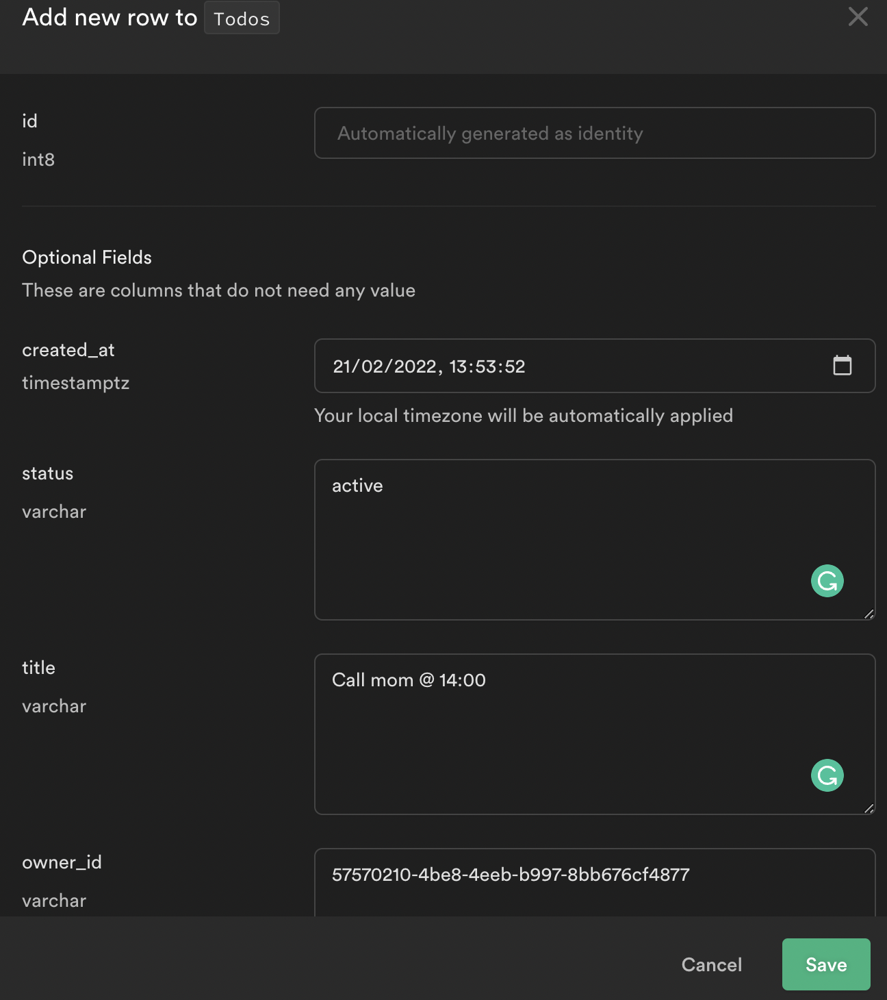
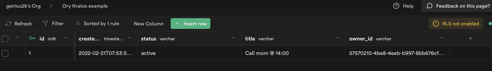

import CodeFromRemote from '../../components/freestanding/utils/codefromremote'

This guide steps through building a gRPC API with REST endpoints and uses Supabase as Cloud Database and Ory Kratos for authenticating users. We configure Ory Cloud to handle authenticating users and managing tokens while writing logic to store data in Supabase Database.

The full code of this guide can be found here

gRPC is a modern open-source high-performance Remote Procedure Call (RPC) framework that can run in any environment. It can efficiently connect services in and across data centers with pluggable support for load balancing, tracing, health checking and authentication. It is also applicable in last mile of distributed computing to connect devices, mobile applications and browsers to backend services.
The gRPC-Gateway is a plugin of the Google protocol buffers compiler protoc. It reads protobuf service definitions and generates a reverse-proxy server which translates a RESTful HTTP API into gRPC. This server is generated according to the google.api.http annotations in your service definitions.

Ory Kratos. Manage identities and users in the cloud Headless and configurable authentication and user management, including MFA, social login, custom identities, and more.

Every Supabase project comes with a full Postgres database, a free and open-source database that is considered one of the world's most stable and advanced databases.

## Step 1. Creating Supabase Project

- From your [Supabase dashboard](https://app.supabase.io/) , click `New project`.
- Enter a Name for your Supabase project.
- Enter a secure Database Password.
- Select the same Region you selected for your Auth0 tenant.
- Click Create new project.

You need to wait couple of minutes while supabase bootstraping your project and then you can create a table.

Open Table editor and click on `Create a new table` button.

- title `varchar`
- status `varchar`
- owner_id `varchar`

## Step 2. Creating data
From the Table editor view, select the todo table and click Insert row.

Fill out the title field and click Save.

Click `insert row`

# Step 3. Creating Ory Cloud Project

From your Ory Cloud dashboard scroll down to the end of sidebar and click ‘Create project’
Input name of your project and click create

# Step 3. Building gRPC API

This project uses [buf.build](https://buf.build) to improve developer experience with protobufs.

<CodeFromRemote
  lang="yml"
  src="https://github.com/gen1us2k/cloudnative_todo_list/blob/master/buf.yaml"
/>

<CodeFromRemote
  lang="yml"
  src="https://github.com/gen1us2k/cloudnative_todo_list/blob/master/buf.gen.yaml"
/>

<CodeFromRemote
  lang="go"
  src="https://github.com/gen1us2k/cloudnative_todo_list/blob/master/server/server.go"
/>

# Step 4. Building Authentication layer

<CodeFromRemote
  lang="go"
  src="https://github.com/gen1us2k/cloudnative_todo_list/blob/master/middleware/middleware.go"
/>

# Step 5. Building Database layer

<CodeFromRemote
  lang="go"
  src="https://github.com/gen1us2k/cloudnative_todo_list/blob/master/database/database.go"
/>

<CodeFromRemote
  lang="go"
  src="https://github.com/gen1us2k/cloudnative_todo_list/blob/master/database/supabase/supabase.go"
/>

# Step 6. Testing our API

