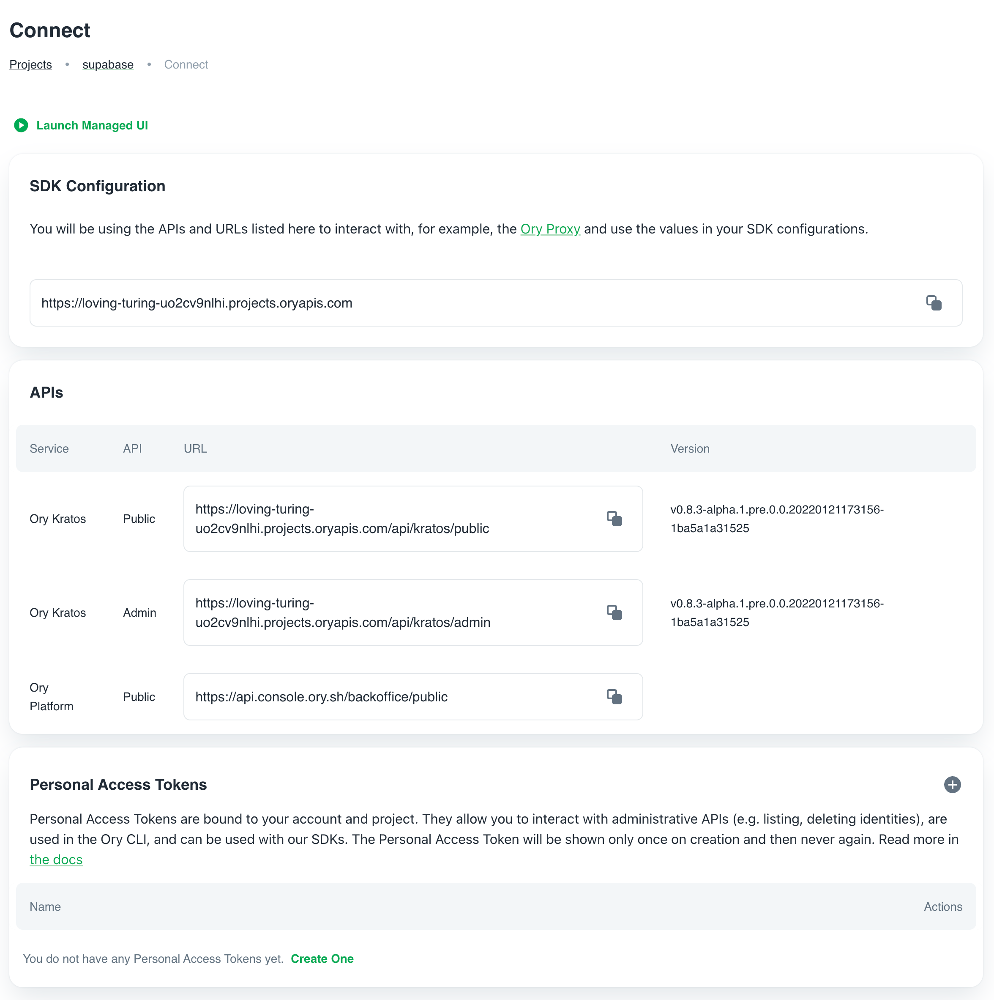

import CodeFromRemote from '../../components/freestanding/utils/codefromremote'

This guide steps through building a gRPC API with REST endpoints and uses Supabase as Cloud Database and Ory Kratos for authenticating users. We configure Ory Cloud to handle authenticating users and managing tokens while writing logic to store data in Supabase Database.

The full code of this guide can be found [here](https://github.com/gen1us2k/cloudnative_todo_list)

[gRPC](https://grpc.io/) is a modern open-source high-performance Remote Procedure Call (RPC) framework that can run in any environment. It can efficiently connect services in and across data centers with pluggable support for load balancing, tracing, health checking and authentication. It is also applicable in last mile of distributed computing to connect devices, mobile applications and browsers to backend services.

The [gRPC-Gateway](https://github.com/grpc-ecosystem/grpc-gateway) is a plugin of the Google protocol buffers compiler protoc. It reads protobuf service definitions and generates a reverse-proxy server which translates a RESTful HTTP API into gRPC. This server is generated according to the google.api.http annotations in your service definitions.

[Ory Kratos](https://www.ory.sh/kratos/docs/) manage identities and users in the cloud Headless and configurable authentication and user management, including MFA, social login, custom identities, and more.

[Supabase](https://supabase.com) is the opensource alternative of firebase. Supabase Database comes with a full [Postgres](https://www.postgresql.org/) database, a free and open-source database that is considered one of the world's most stable and advanced databases.


## Why gRPC

gRPC has the following features that make developer experience building APIs friendly

- Code Generation. The Proto file represents a contract of gRPC services and messages. The protoc compiler generates a complete client.
- Protocol buffers enable strict specification and strongly typed messages. gRPC is consistent across platforms and specifications.
- Deadline/timeouts and cancellation.

**gRPC weaknesses**

- Lack of browser support
- Not human-readable


## Step 1. Creating Supabase Project

- From your [Supabase dashboard](https://app.supabase.io/) , click `New project`.
- Enter a `Name` for your Supabase project.
- Enter a secure `Database Password`.
- Select `Region` you want.
- Click Create new project.


After a couple of minutes of bootstrapping your project, you can create tables and work with the database. Open Table editor and click on `Create a new table` button.

- title `varchar`
- status `varchar`
- owner_id `varchar`


## Step 2. Creating data

From the `Table` editor view, select the todo table and click Insert row.

Fill out the title field and click Save.


Click `insert row`


# Step 3. Creating Ory Cloud Project

From your Ory Cloud dashboard scroll down to the end of sidebar and click ‘Create project’
Input name of your project and click create


You'll see the following screen with needed URls to configure SDKs



# Step 3. Building gRPC API. Bootstrapping the project

This project uses [buf.build](https://buf.build) to improve developer experience with protobufs. Create `/buf.yaml` file with the following content

<CodeFromRemote
  lang="yml"
  src="https://github.com/gen1us2k/cloudnative_todo_list/blob/master/buf.yaml"
/>

The next thing will generate all files from our protobuf. Create `/buf.gen.yaml` with the following content

<CodeFromRemote
  lang="yml"
  src="https://github.com/gen1us2k/cloudnative_todo_list/blob/master/buf.gen.yaml"
/>

The specification of our todolist API goes to `todolist/todolist.proto` file with the following content

```protobuf
syntax = "proto3";

package grpc.v1;

option go_package ="github.com/gen1us2k/cloudnative_todo_list/grpc/v1/todolist";

import "google/api/annotations.proto";
import "google/protobuf/empty.proto";

message User {
	string id = 1;
	string first_name = 2;
	string last_name = 3;
	string email = 4;
}

message Todo {
	int64 id = 1;
	string title = 2;
	string status = 3;
	User owner = 4;
}

message DeleteResponse {
	string status = 1;
	string lo = 2;
}
message TodoListResponse {
	repeated Todo todos = 1;
}

service TodolistAPIService {
	rpc CreateTodo(Todo) returns (Todo) {
		option (google.api.http) = {
			post: "/api/todo"
			body: "*"
		};
	}
	rpc ListTodos(google.protobuf.Empty) returns (TodoListResponse) {
		option (google.api.http) = {
			get: "/api/todo"
		};
	}
	rpc UpdateTodo(Todo) returns (Todo) {
		option (google.api.http) = {
			post: "/api/todo/{id}"
			body: "*"
		};
	}
	rpc DeleteTodo(Todo) returns (DeleteResponse) {
		option (google.api.http) = {
			delete: "/api/todo/{id}"
			body: "*"
		};
	}
}
```

## Step 4. Installing dependencies

```
	brew tap bufbuild/buf
	brew install buf
	go install google.golang.org/protobuf/cmd/protoc-gen-go@v1.26
	go install google.golang.org/grpc/cmd/protoc-gen-go-grpc@v1.1
```

## Step 5. Building gRPC API. Building Database layer

<CodeFromRemote
  lang="go"
  src="https://github.com/gen1us2k/cloudnative_todo_list/blob/master/database/database.go"
/>

<CodeFromRemote
  lang="go"
  src="https://github.com/gen1us2k/cloudnative_todo_list/blob/master/database/supabase/supabase.go"
/>

## Step 6. Building gRPC API. Authentication layer

<CodeFromRemote
  lang="go"
  src="https://github.com/gen1us2k/cloudnative_todo_list/blob/master/middleware/middleware.go"
/>

## Step 7. Implementing server

<CodeFromRemote
  lang="go"
  src="https://github.com/gen1us2k/cloudnative_todo_list/blob/master/server/server.go"
/>

## Step 8. Building a web interface
