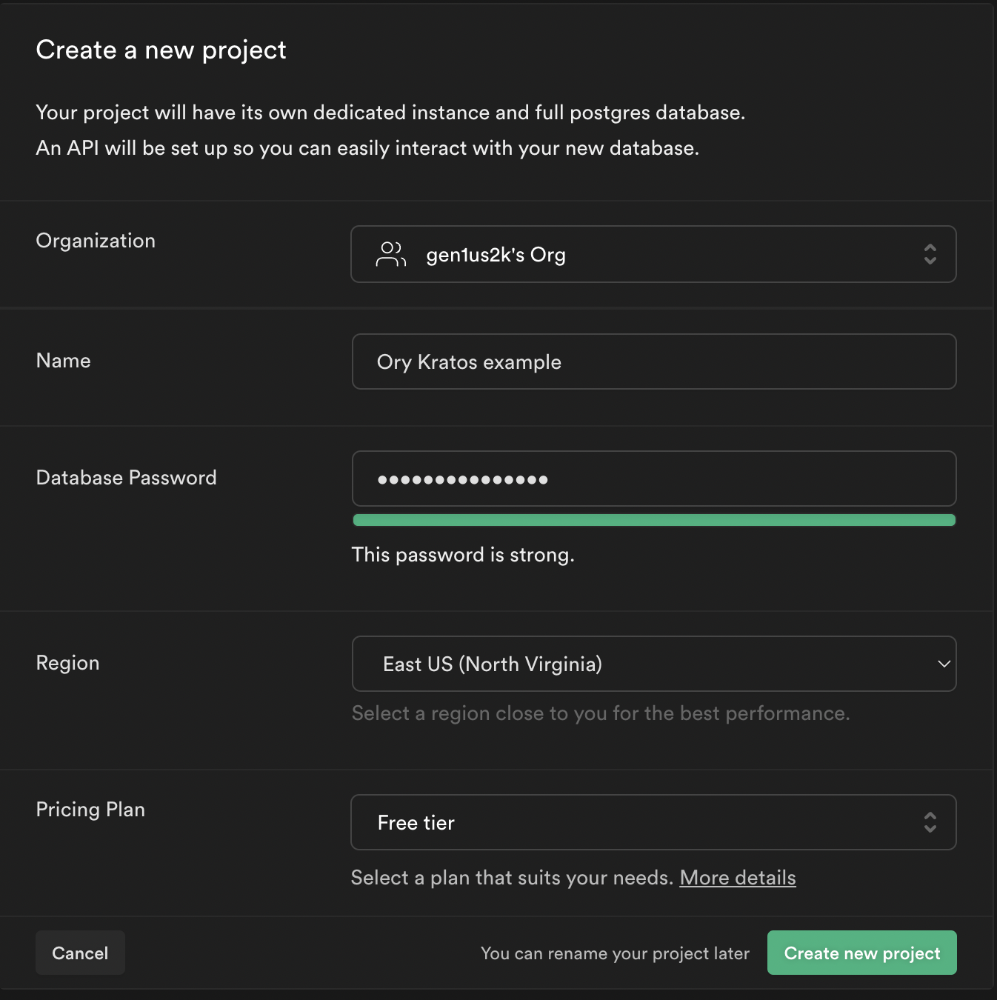

import CodeFromRemote from '../../components/freestanding/utils/codefromremote'

This guide steps through building a gRPC API with REST endpoints and uses Supabase as Cloud Database and Ory Kratos for authenticating users. We configure Ory Cloud to handle authenticating users and managing tokens while writing logic to store data in Supabase Database.

The full code of this guide can be found [here](https://github.com/gen1us2k/cloudnative_todo_list)

## What technologies do we use in this example

[gRPC](https://grpc.io/) is a modern open-source high-performance Remote Procedure Call (RPC) framework that can run in any environment. It can efficiently connect services in and across data centers with pluggable support for load balancing, tracing, health checking and authentication. It is also applicable in last mile of distributed computing to connect devices, mobile applications and browsers to backend services.

The [gRPC-Gateway](https://github.com/grpc-ecosystem/grpc-gateway) is a plugin of the Google protocol buffers compiler protoc. It reads protobuf service definitions and generates a reverse-proxy server which translates a RESTful HTTP API into gRPC. This server is generated according to the google.api.http annotations in your service definitions.

[Ory Kratos](https://www.ory.sh/kratos/docs/) manage identities and users in the cloud Headless and configurable authentication and user management, including MFA, social login, custom identities, and more.

[Supabase](https://supabase.com) is the opensource alternative of firebase. Supabase Database comes with a full [Postgres](https://www.postgresql.org/) database, a free and open-source database that is considered one of the world's most stable and advanced databases.


## Why gRPC

gRPC has the following features that make developer experience building APIs friendly

- Code Generation. The Proto file represents a contract of gRPC services and messages. The protoc compiler generates a complete client.
- Protocol buffers enable strict specification and strongly typed messages. gRPC is consistent across platforms and specifications.
- Deadline/timeouts and cancellation.
- Teams can't skip the process of defining schemas and writing documentation for their APIs.

**gRPC weaknesses**

- Lack of browser support
- Not human-readable

Despite the weaknesses above, gRPC is still good for:

- Building communication protocol between microservices.
- Building API for mobile apps. gRPC has excellent support for bi-directional streaming. Hence you can easily add real-time communication features to your mobile app.
- Network constraint environments gRPC messages are serialized with Protobuf, a lightweight message format. A gRPC message is always smaller than an equivalent JSON message and uses less CPU time for encoding/decoding messages.

In this example, we will build a todolist API for mobile apps using gRPC.  We will use REST endpoints as a fallback for browsers. Let's start configuring supabase

## Step 1. Creating Supabase Project

- From your [Supabase dashboard](https://app.supabase.io/) , click `New project`.
- Enter a `Name` for your Supabase project.
- Enter a secure `Database Password`.
- Select `Region` you want.
- Click Create new project.



After a couple of minutes of bootstrapping your project, you can create tables and work with the database. Open Table editor and click on `Create a new table` button.

- title `varchar`
- status `varchar`
- owner_id `varchar`


## Step 2. Creating data

From the `Table` editor view, select the todo table and click Insert row. Fill out the title field and click Save.


Click `insert row`


# Step 3. Creating Ory Cloud Project

From your Ory Cloud dashboard scroll down to the end of sidebar and click ‘Create project’
Input name of your project and click create


You'll see the following screen with needed URls to configure SDKs


# Step 4. Building gRPC API. Bootstrapping the project

When you build gRPC API, you need to deal with protoc to generate stubs/messages for your project. When you make API using Go programming language with a couple of gRPC plugins, you need to write a lot of arguments for the protoc compiler, and it forces you to save them somewhere, e.g. in Makefile. Here's a simple example of generating stubs with a couple of plugins enabled.

```shell

protoc -I. \
       -I/usr/local/include \
       -I$GOPATH/src \
       -I$GOPATH/src/github.com/grpc-ecosystem/grpc-gateway/third_party/googleapis \
       -I$GOPATH/src/github.com/grpc-ecosystem/grpc-gateway \
       -I$GOPATH/src/github.com/lyft/protoc-gen-validate \
       --go_out=plugins=grpc:$GOPATH/src \
       --validate_out=lang=go:$GOPATH/src \
       /path/to/service.proto
```


[Buf.build](https://buf.build) improves developer experience with protobufs and simplifies generation to a simple `buf generate` command. Create `/buf.yaml` file with the following content

<CodeFromRemote
  lang="yml"
  src="https://github.com/gen1us2k/cloudnative_todo_list/blob/master/buf.yaml"
/>

The `buf.yaml` file defines a module, and is placed at the root of the Protobuf source files it defines. The placement of the buf.yaml configuration tells buf where to search for .proto files, and how to handle imports. This file contains lint and breaking change detection rules, and if applicable, the name of your module and a list of dependencies.

The `buf.gen.yaml` file defines a local generation template, and is used by the `buf generate` command to generate code for the language(s) of your choice. Create `/buf.gen.yaml` with the following content

<CodeFromRemote
  lang="yml"
  src="https://github.com/gen1us2k/cloudnative_todo_list/blob/master/buf.gen.yaml"
/>

The specification of our todolist API goes to `todolist/todolist.proto` file with the following content

```protobuf
syntax = "proto3";

package grpc.v1;

option go_package ="github.com/gen1us2k/cloudnative_todo_list/grpc/v1/todolist";

import "google/api/annotations.proto";
import "google/protobuf/empty.proto";

message User {
	string id = 1;
	string first_name = 2;
	string last_name = 3;
	string email = 4;
}

message Todo {
	int64 id = 1;
	string title = 2;
	string status = 3;
	User owner = 4;
}

message DeleteResponse {
	string status = 1;
	string lo = 2;
}
message TodoListResponse {
	repeated Todo todos = 1;
}

service TodolistAPIService {
	rpc CreateTodo(Todo) returns (Todo) {
		option (google.api.http) = {
			post: "/api/todo"
			body: "*"
		};
	}
	rpc ListTodos(google.protobuf.Empty) returns (TodoListResponse) {
		option (google.api.http) = {
			get: "/api/todo"
		};
	}
	rpc UpdateTodo(Todo) returns (Todo) {
		option (google.api.http) = {
			post: "/api/todo/{id}"
			body: "*"
		};
	}
	rpc DeleteTodo(Todo) returns (DeleteResponse) {
		option (google.api.http) = {
			delete: "/api/todo/{id}"
			body: "*"
		};
	}
}
```

## Step 5. Building gRPC API. Building Database layer
Supabase uses Postgres as the primary RDBMS for their Cloud and postgREST plugin. PostgREST is a standalone web server that turns your PostgreSQL database directly into a RESTful API. Here's an architecture diagram is taken from their documentation about their architecture.


Let's define our database layer with this interface

<CodeFromRemote
  lang="go"
  src="https://github.com/gen1us2k/cloudnative_todo_list/blob/master/database/database.go"
/>

Here's the implementation of the database interface

<CodeFromRemote
  lang="go"
  src="https://github.com/gen1us2k/cloudnative_todo_list/blob/master/database/supabase/supabase.go"
/>

## Step 6. Building gRPC API. Authentication layer

<CodeFromRemote
  lang="go"
  src="https://github.com/gen1us2k/cloudnative_todo_list/blob/master/middleware/middleware.go"
/>

## Step 7. Implementing server

<CodeFromRemote
  lang="go"
  src="https://github.com/gen1us2k/cloudnative_todo_list/blob/master/server/server.go"
/>

## Step 8. Configuration package for our application

<CodeFromRemote
  lang="go"
  src="https://github.com/gen1us2k/cloudnative_todo_list/blob/master/config/config.go"
/>

## Step 9. The cmd package

<CodeFromRemote
  lang="go"
  src="https://github.com/gen1us2k/cloudnative_todo_list/blob/master/cmd/todolist/main.go"
/>

## Step 10. Final


