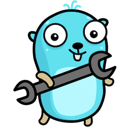

import CodeFromRemote from '../../components/freestanding/utils/codefromremote'

I’m a huge fan of automating working processes. I try to automate everything and
save my coworkers time.

This article I will show you how to improve the community onboarding journey
with a custom Slack bot using the Slack Events API, hosted on AWS Lambda.

## Motivation

We used to have a [bot](https://greet.bot/) greeting new members in the
[Ory Community Slack](https://slack.ory.sh/). It messages new members with an
introduction to help get an overview of the Ory community and products.  
Since this way of onboarding new members is _impersonal_ and _one-way_ so the
Ory DevRel team was looking for ways to improve it by making it _personal_ and
_two-way_:

1. Message each new member personally.
2. Ask them what their biggest challenges or struggles are or what they want to
   achieve by joining the Ory community.
3. Point them to the right place or people who can help with that challenge or
   help them achieve their goals.

To keep the workload manageable, the initial message is pre-composed. A bot
would either notify the team when new members join or message new members from a
"human" account. So the options are:

- Ping the Ory DevRel team and notify them to greet a user.
- Send a greeting message from a Slack user.

We landed on the second option and let the bot use a **User OAuth Token** to
send messages as a user. In the next part of the blog post, I’ll tell you how to
build this bot.

## Using Slack API

Slack offers you a few examples of using APIs:

- [Realtime API](https://api.slack.com/rtm)
- [Webhook integration](https://api.slack.com/messaging/webhooks)
- [Events API](https://api.slack.com/apis/connections/events-api)

I built Slack bots before, and the following two chapters are about the
difference between **WebSockets** integration and the **Events API**. Just for
convenience, let’s say that the Events API and webhook integration works almost
the same way.

### Websockets

Websocket is an excellent protocol. It's easy to implement, developer friendly,
and works on top of HTTP1/1. The protocol was first described in 2008, and in
2010 there was broad browser support. Websockets made the developer experience
building realtime web applications much more enjoyable back in the day because
you did't need to deal with
[BOSH](<https://en.wikipedia.org/wiki/BOSH_(protocol)>) and
[chunked encoding](https://en.wikipedia.org/wiki/Chunked_transfer_encoding) of
HTTP1/1. Furthermore, new architectural patterns and paradigms such as
[Event-Driven Architecture](https://en.wikipedia.org/wiki/Event-driven_architecture)
and [Event-Driven SOA](https://en.wikipedia.org/wiki/Event-driven_SOA) were
described.

Despite the benefits described above, WebSockets have drawbacks. One of the most
significant drawbacks is that it's built on-top-of HTTP/1.1 and keeps the
connection open. It leads to scaling problems when you have more users for your
application. We have two ways to scale our application:

- Vertical scaling. You add more resources such as RAM/disk/CPU or buy a new
  server.
- Horizontal scaling. You add more servers. You can move a database, webserver,
  or something else to a different server. Sometimes you need to scale your
  application horizontally.

Horizontal scaling requires load balancing between the servers. Balancing HTTP
traffic is easier than WebSocket traffic, and almost all load balancers such as
Nginx, Envoy, or Istio balance traffic on L4 of the
[OSI model](https://en.wikipedia.org/wiki/OSI_model). It would be best to
implement load balancing mechanisms on L7 when you work with WebSockets to have
evenly loaded servers.

Furthermore, it would be best to keep in mind that networks are unreliable or
third parties may close connections and your application needs to handle it
gracefully. In addition, you need to have a persistent listener of incoming
events, which leads to the situation when you need to have EC2/VPS or any other
server to run your code, but this is a cost-ineffective solution.

### Events API

The Slack Events API works differently. You need to have a web server that is be
publicly accessible and an event handler implemented in your app. According to
the documentation of the Slack Events API, you need to implement the following
steps:

- Use their signing tokens for incoming requests.
- Handle the URL verification challenge by your app. The app needs to sign the
  incoming request and return the incoming challenge parameter.

The only thing we need to have is a web server with a simple REST API endpoint.
It allows us to use various cloud features to run our bot and save money. For
instance, we can use AWS Lambda, trigger it with API Gateway. The best part of
this is that we can use the Free tier plan. That's why I'm a huge fan of the
Events API from Slack.



_Let's build our bot, huh?_

## Implementing the bot

We will use the Go programming language to build our bot. What we need:

- Configuration for the bot using 12factors.net. In that case we will use the
  [envconfig](https://github.com/kelseyhightower/envconfig) package because of
  its simplicity.
- `net/http` package for local development and testing.
- [Ngrok](https://ngrok.com/) to make our web app accessible from the internet.
- [AWS Go SDK](https://aws.amazon.com/sdk-for-go/).

## Implementing configuration

Let's create a `config` package

<CodeFromRemote
  lang="go"
  src="https://github.com/ory/mrrobot/blob/master/config/config.go"
/>

It's always a good idea to have some tests.

<CodeFromRemote
  lang="go"
  src="https://github.com/ory/mrrobot/blob/master/config/config_test.go"
/>

We can check it by simply running `go test ./…`

### Slack events API handler

We can start with the example taken from the
[Slack Go SDK](https://github.com/slack-go/slack/blob/master/examples/eventsapi/events.go)
because of its simplicity. We need to extend this example with the following
parts:

- Make it configurable what message we want to send as welcome.
- Support of AWS Lambda since it has its SDK. To get support for Go we can use
  the [algnhsa](https://github.com/akrylysov/algnhsa) library. Check out the
  code below.

<CodeFromRemote
  lang="go"
  src="https://github.com/gen1us2k/mrrobot/blob/master/app/app.go"
/>

To start everything up we need `cmd/mrrobot/main.go`:

<CodeFromRemote
  lang="go"
  src="https://github.com/gen1us2k/mrrobot/blob/master/cmd/mrrobot/main.go"
/>

### Creating Slack bot

1. Press **Create New App** button on
   [Slack apps page](https://api.slack.com/apps).
2. Click on **From scratch** and then input your bot name and choose a workspace
   to install the bot.
3. Copy the `Signing Secret` and store it somewhere. You'll need it to configure
   AWS Lambda function.
4. Go to the `OAuth & Permissions` and generate access tokens under
   `Oauth Tokens for YOur Workspace`. You need the `User Oauth Token`when you
   want to send message from a user and the `Bot User Oauth Token` for the bot
   user. You'll need it to configure AWS Lambda.
5. Under the scopes add `chat:write` for both the `Bot Token` and `User token`
   scopes.

## Deploying to AWS Lambda

1. Sign in to [AWS Console](https://console.aws.amazon.com/).
2. Go to the Lambda section and press `Create function` button.
3. Choose `Author from scratch` input the name of the function. Choose `Go 1.x`
   for the runtime and architecture `x86_64` and then create a function.
4. Open `Configuration` -> `Environment variables`.
5. Set your `Signing Token` to `SLACK_SIGNING_SECRET` variable.
6. Set your welcome message to `WELCOME_MESSAGE` variable.
7. Set your bot token to `SLACK_BOT_TOKEN` variable.
8. Set `production` to `ENV` variable.
9. Go to the `Code` section and scroll down to `Runtime settings` and change
   `Handler` from `hello` to `mrrobot`.

### Configuring AWS Gateway

1. Create a new REST API.
1. In the "Resources" section create a new `ANY` method to handle requests to
   `/` (check "Use Lambda Proxy Integration").
   
1. Add a catch-all `{proxy+}` resource to handle requests to every other path
   (check "Configure as proxy resource").
   

## Final steps

You need to upload the zip archive with compiled binary to the AWS lambda. In
that case, `make` can help us -
[`make`](https://man7.org/linux/man-pages/man1/make.1.html) allows us to
automate operations since 1976. Also it always a great idea to have them
self-documented:

```make
.PHONY: help

help:
            @grep -E '^[a-zA-Z_-]+:.*?## .*$$' $(MAKEFILE_LIST) | sort | awk 'BEGIN {FS = ":.*?## "}; {printf "\033[36m%-30s\033[0m %s\n", $$1, $$2}'

lint: ## Runs linter against the code
            golangci-lint run ./...

test: ## Run tests locally
            go test ./...

build_docker: ## Build docker image
            docker build -t mrrobot .

build_linux: ## Build executable for linux system
            GOOS=linux GOARCH=amd64 go build -o mrrobot cmd/mrrobot/main.go

zip: build_linux  ## Build and create a zip archive for deploying to AWS lambda
            zip main.zip mrrobot
```

1. Run `make zip`.
1. Open your function on `AWS Lambda`.
1. Choose `Upload from` under the source code section.
1. Upload it and run.
1. Choose your application on [Apps page](https://api.slack.com/apps) on Slack,
   click on `Add features and functionality` and choose `Event subscriptions`.
1. Insert URL of your API Gateway to the `Request URL` field, pass the
   verification step and click `Save`.
1. Open `Subscribe to bot events` and choose `team_join` event and then press
   `Save`.

That's it. You can now invite a new member to your Slack and test the bot.

## Conclusion and takeaways

As you can see the Slack Events API helps you to build bots and automate your
routine. Also, if you just build a simple bot you don’t need to spend money on
hosting.

> Join the [Ory Community Slack](https://slack.ory.sh/) to see the bot in action
> and let us know what you think!
