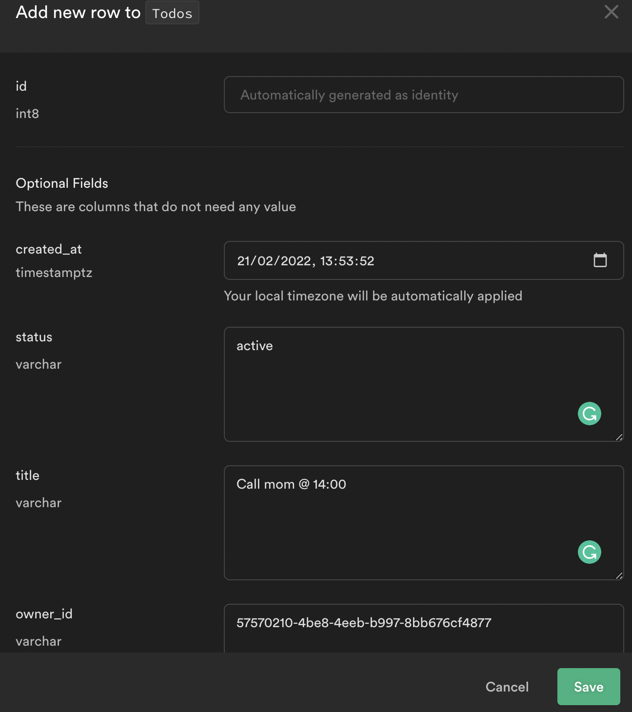
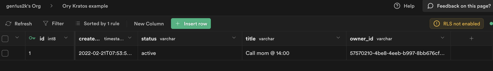

import CodeFromRemote from '../../components/freestanding/utils/codefromremote'

This guide steps through building a gRPC API with REST endpoints and uses Supabase as Cloud Database and Ory Kratos for authenticating users. We configure Ory Cloud to handle authenticating users and managing tokens while writing logic to store data in Supabase Database.

The full code of this guide can be found [here](https://github.com/gen1us2k/cloudnative_todo_list)

## What technologies do we use in this example

[Ory Kratos](https://www.ory.sh/kratos/docs/) manage identities and users in the cloud Headless and configurable authentication and user management, including MFA, social login, custom identities, and more.

[Supabase](https://supabase.com) is the opensource alternative of firebase. Supabase Database comes with a full [Postgres](https://www.postgresql.org/) database, a free and open-source database that is considered one of the world's most stable and advanced databases.

[Ory Oathkeeper](https://www.ory.sh/docs/oathkeeper) as Identity and access proxy

[Nuxt.js](https://nuxtjs.org) as frontend

[TailwindCSS](https://tailwindcss.com/)

[Migrate](https://github.com/golang-migrate/migrate) to perform database migrations

[Postgres]() as an additional storage

## Why I chose Go/Gin/Migrate for this project

I'm huge fan of Go programming language and I've been coding using Go from late 2014. I built couple of projects and I love simplicity of Go and ecosystem around it.

Go is simple, but ecosystem and tooling around language are great.

Reasons to Go

- Golangcilinter
- Staticly and strongly typed programming language
- Lightwheight docker containers
- Code readability
- Easy to follow SOLID principles and clean architecture

### Gomigrate vs Goose

I used both goose and golang-migrate in my pet projects and projects in production. My first tool managing database migrations was mattes/migrate (It's golang-migrate now) but something changed in transition from 2 to 3 versions and I moved to goose. Then I had a break using Go and I decided to make a research.

My requirements for Go migration tool:

1. Plain SQL migrations support. I don't want to learn an additional filetype format. I know SQL and I know how to create tables. That's enough. Unlike Django Go does not have any good Active Record pattern implementations. I hope that there will be more ORMs and better tooling once Go 1.18 released (Generics are on the way).
2. Support of opensource RDBMS like Postgres, MySQL (and all their forks), Oracle (but I don't use it yet)
3. Programmable API or shorthanded way to apply migrations
4. Upward/Downward support

Both projects are awesome they meet my needs but I chose migrate because it supports more databases (I'm going to use different databases in my example in nearest future and write blog posts)

### Gin.

I'm huge fan of gRPC when I build APIs with Go and I used it a lot in my previous experience. Also, I'm huge fan of echo framework. I chose gin because of it's simplicity and feature rich support. Actually a simple `net/http` would be enough to build this project with httprouter but to make things more conveinent I chose gin.


## Why Nuxt.js and TailwindCSS
Because I can

## Small disclaimer about the frontend part

I assume that example can have some mistakes of building frontend, but I'm not frontend engineer so please understand me and forgive me :D


## Step 1. Creating Supabase Project

- From your [Supabase dashboard](https://app.supabase.io/) , click `New project`.
- Enter a `Name` for your Supabase project.
- Enter a secure `Database Password`.
- Select `Region` you want.
- Click Create new project.


After a couple of minutes of bootstrapping your project, you can create tables and work with the database. Open Table editor and click on `Create a new table` button.

- title `varchar`
- status `varchar`
- owner_id `varchar`


## Step 2. Creating data

From the `Table` editor view, select the todo table and click Insert row. Fill out the title field and click Save.



Click `insert row`



# Step 3. Creating Ory Cloud Project

From your Ory Cloud dashboard scroll down to the end of sidebar and click ‘Create project’
Input name of your project and click create


You'll see the following screen with needed URls to configure SDKs


# Step 4. Building gRPC API. Bootstrapping the project

When you build gRPC API, you need to deal with protoc to generate stubs/messages for your project. When you make API using Go programming language with a couple of gRPC plugins, you need to write a lot of arguments for the protoc compiler, and it forces you to save them somewhere, e.g. in Makefile. Here's a simple example of generating stubs with a couple of plugins enabled.

```shell

protoc -I. \
       -I/usr/local/include \
       -I$GOPATH/src \
       -I$GOPATH/src/github.com/grpc-ecosystem/grpc-gateway/third_party/googleapis \
       -I$GOPATH/src/github.com/grpc-ecosystem/grpc-gateway \
       -I$GOPATH/src/github.com/lyft/protoc-gen-validate \
       --go_out=plugins=grpc:$GOPATH/src \
       --validate_out=lang=go:$GOPATH/src \
       /path/to/service.proto
```


[Buf.build](https://buf.build) improves developer experience with protobufs and simplifies generation to a simple `buf generate` command. Create `/buf.yaml` file with the following content

<CodeFromRemote
  lang="yml"
  src="https://github.com/gen1us2k/cloudnative_todo_list/blob/master/buf.yaml"
/>

The `buf.yaml` file defines a module, and is placed at the root of the Protobuf source files it defines. The placement of the buf.yaml configuration tells buf where to search for .proto files, and how to handle imports. This file contains lint and breaking change detection rules, and if applicable, the name of your module and a list of dependencies.

The `buf.gen.yaml` file defines a local generation template, and is used by the `buf generate` command to generate code for the language(s) of your choice. Create `/buf.gen.yaml` with the following content

<CodeFromRemote
  lang="yml"
  src="https://github.com/gen1us2k/cloudnative_todo_list/blob/master/buf.gen.yaml"
/>

The specification of our todolist API goes to `todolist/todolist.proto` file with the following content

```protobuf
syntax = "proto3";

package grpc.v1;

option go_package ="github.com/gen1us2k/cloudnative_todo_list/grpc/v1/todolist";

import "google/api/annotations.proto";
import "google/protobuf/empty.proto";

message User {
	string id = 1;
	string first_name = 2;
	string last_name = 3;
	string email = 4;
}

message Todo {
	int64 id = 1;
	string title = 2;
	string status = 3;
	User owner = 4;
}

message DeleteResponse {
	string status = 1;
	string lo = 2;
}
message TodoListResponse {
	repeated Todo todos = 1;
}

service TodolistAPIService {
	rpc CreateTodo(Todo) returns (Todo) {
		option (google.api.http) = {
			post: "/api/todo"
			body: "*"
		};
	}
	rpc ListTodos(google.protobuf.Empty) returns (TodoListResponse) {
		option (google.api.http) = {
			get: "/api/todo"
		};
	}
	rpc UpdateTodo(Todo) returns (Todo) {
		option (google.api.http) = {
			post: "/api/todo/{id}"
			body: "*"
		};
	}
	rpc DeleteTodo(Todo) returns (DeleteResponse) {
		option (google.api.http) = {
			delete: "/api/todo/{id}"
			body: "*"
		};
	}
}
```

## Step 5. Building gRPC API. Building Database layer
Supabase uses Postgres as the primary RDBMS for their Cloud and postgREST plugin. PostgREST is a standalone web server that turns your PostgreSQL database directly into a RESTful API. Here's an architecture diagram is taken from their documentation about their architecture.


Let's define our database layer with this interface

<CodeFromRemote
  lang="go"
  src="https://github.com/gen1us2k/cloudnative_todo_list/blob/master/database/database.go"
/>

Here's the implementation of the database interface

<CodeFromRemote
  lang="go"
  src="https://github.com/gen1us2k/cloudnative_todo_list/blob/master/database/supabase/supabase.go"
/>

## Step 6. Building gRPC API. Authentication layer

<CodeFromRemote
  lang="go"
  src="https://github.com/gen1us2k/cloudnative_todo_list/blob/master/middleware/middleware.go"
/>

## Step 7. Implementing server

<CodeFromRemote
  lang="go"
  src="https://github.com/gen1us2k/cloudnative_todo_list/blob/master/server/server.go"
/>

## Step 8. Configuration package for our application

<CodeFromRemote
  lang="go"
  src="https://github.com/gen1us2k/cloudnative_todo_list/blob/master/config/config.go"
/>

## Step 9. The cmd package

<CodeFromRemote
  lang="go"
  src="https://github.com/gen1us2k/cloudnative_todo_list/blob/master/cmd/todolist/main.go"
/>

## Step 10. Final


