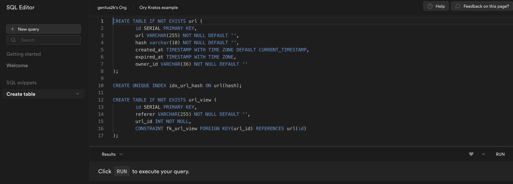

import CodeFromRemote from '../../components/freestanding/utils/codefromremote'

One can save time by using ready solutions to build a completely new product. Many startups solve one problem and do it best. For instance, we have at least three cloud providers to host our code. We have multiple choices on what to choose to build a frontend for our next project. At least we have vue.js and react.js projects with broad communities.
In this article, I'll show you an example of how to build an URL shortener using a modern technology stack.

You can find complete project [here](https://github.com/gen1us2k/shorts)

## What technologies do we use in this example

[Ory Kratos](https://www.ory.sh/kratos/docs/) to manage identities and users. We'll use an open source self-hosted version in this article, but consider using [Ory Cloud](https://ory.sh/docs/cloud) in the production.

[Supabase](https://supabase.com) is the opensource alternative of firebase. Supabase Database comes with a full [Postgres](https://www.postgresql.org/) database, a free and open-source database that is considered one of the world's most stable and advanced databases. We'll use Supabase as Database for our url shortener project

[Ory Oathkeeper](https://www.ory.sh/docs/oathkeeper) would be a great example of applying Zero Trust architecture for our project. We'll use it as Identity and access proxy.

[Nuxt.js](https://nuxtjs.org) to build Vue.js application with confidence . An open source framework making web development simple and powerful.

[TailwindCSS](https://tailwindcss.com/) A utility-first CSS framework packed with classes like flex, pt-4, text-center and rotate-90 that can be composed to build any design, directly in your markup.

[Migrate](https://github.com/golang-migrate/migrate) to perform database migrations

[Postgres](https://www.postgresql.org/) is a powerful, open source object-relational database system with over 30 years of active development that has earned it a strong reputation for reliability, feature robustness, and performance.


## A short explanation about backend choices

I'm a huge fan of the Go programming language, and I've been coding using this language since late 2014. I love the simplicity of Go language design and the ecosystem around it. Why to Go

- It's good to perform static code analysis to make your backend systems more robust and stable. GolangCI-lint is a feature-rich linter that gives you feedback about your code. You can find a lot of linters available.
- Strongly typed programming language with static data types. One does not need to write tests to check that your code will never mess with data types. `int i' makes `i' int forever.
- It's easy to follow SOLID principles and clear architecture using Go.
- In addition, Go is fast and well-scaled programming language

### Database migrations

Database migrations should be used once you use any RDMBS in your project because you need to change database schema time-to-time. It helps you track versions of your schema and easily perform forwards and downwards migrations. In the pythonic world, it's easy to decide what tool to use for schema migration because it's usually come out of the box by the selected framework. For instance, we have flask-migrate for flask and Django migrations for Django. Since Go uses UNIX philosophy to build the architecture of your project, you need to choose

- HTTP router for your endpoints
- Requests multiplexor
- ORM or a library to work with the database
- a tool to perform migrations

Go programming language has at least two tools for schema migrations. I used both goose and migrate, and in this project, I decided to go with migrate. Migrate supports more databases, and I want to make the DB layer in this project database agnostic.

My requirements for Go migration tool:

1. Plain SQL migrations support. I don't want to learn an additional filetype format. I know SQL and I know how to create tables. That's enough. Unlike Django Go does not have any good Active Record pattern implementations. I hope that there will be more ORMs and better tooling once Go 1.18 released (Generics are on the way).
2. Support of opensource RDBMS like Postgres, MySQL (and all their forks), Oracle (but I don't use it yet)
3. Programmable API or shorthanded way to apply migrations
4. Upward/Downward support


### Gin.

A URL shortener is a lightweight service, and it would be best to have a simple enough package to build an HTTP API around it. You  have several options on what to choose to solve this issue, and the most popular frameworks are

- Echo
- Gin
- Go-kit

Go-kit is an excellent framework for building a complex system with many microservices. Even a simple net/http with http router would be enough for our example. Usually, I toss a coin when I choose between echo and gin, so I use gin in this project.

I'm huge fan of gRPC when I build APIs with Go and I used it a lot in my previous experience. Also, I'm huge fan of echo framework. I chose gin because of it's simplicity and feature rich support. Actually a simple `net/http` would be enough to build this project with httprouter but to make things more conveinent I chose gin.

Okay. Let's start hacking, shall we?

## Defining Database schema.

The URL shortener should have the following tables:

- `url` table to store shortened URLs
- `url_view` table to store views. This information will be useful to build additional reports for users about top referrers, urlviews or something else.

```sql
CREATE TABLE IF NOT EXISTS url (
	id SERIAL PRIMARY KEY,
	url VARCHAR(255) NOT NULL DEFAULT '',
	hash varchar(10) NOT NULL DEFAULT '',
	created_at TIMESTAMP WITH TIME ZONE DEFAULT CURRENT_TIMESTAMP,
	expired_at TIMESTAMP WITH TIME ZONE,
	owner_id VARCHAR(36) NOT NULL DEFAULT ''
);

CREATE UNIQUE INDEX idx_url_hash ON url(hash);

CREATE TABLE IF NOT EXISTS url_view (
	id SERIAL PRIMARY KEY,
	referer VARCHAR(255) NOT NULL DEFAULT '',
	url_id INT NOT NULL,
	CONSTRAINT fk_url_view FOREIGN KEY(url_id) REFERENCES url(id)
);
```

## Creating supabase project and tables


- From your [Supabase dashboard](https://app.supabase.io/) , click `New project`.
- Enter a `Name` for your Supabase project.
- Enter a secure `Database Password`.
- Select `Region` you want.
- Click Create new project.


- Open table editor
- Click on `SQL editor` on sidebar
- Insert SQL table definition from the previous step
- Click Run to create tables



## Designing the Database

<CodeFromRemote
  src="https://github.com/gen1us2k/shorts/blob/master/database/database.go"
  lang="golang"
/>

## Implementing the Database

<CodeFromRemote
  src="https://github.com/gen1us2k/shorts/blob/master/database/supabase.go"
  lang="golang"
/>

## Designing the API

<CodeFromRemote
  src="https://github.com/gen1us2k/shorts/blob/master/api/api.go"
  lang="golang"
/>

## Configuration and building it together

<CodeFromRemote
  src="https://github.com/gen1us2k/shorts/blob/master/cmd/shorts/main.go"
  lang="golang"
/>
<CodeFromRemote
  src="https://github.com/gen1us2k/shorts/blob/master/config/config.go"
  lang="golang"
/>

## Configuring oathkeeper

<CodeFromRemote
  src="https://github.com/gen1us2k/shorts/blob/master/oathkeeper/oathkeeper.yml"
  lang="yaml"
/>

Access rules

<CodeFromRemote
  src="https://github.com/gen1us2k/shorts/blob/master/oathkeeper/access-rules.yml"
  lang="yaml"
/>

## Configuring Kratos

You can simply follow the quickstart guide

## Frontend

## Testing

## Further steps


# Step 3. Creating Ory Cloud Project

From your Ory Cloud dashboard scroll down to the end of sidebar and click ‘Create project’
Input name of your project and click create


You'll see the following screen with needed URls to configure SDKs


