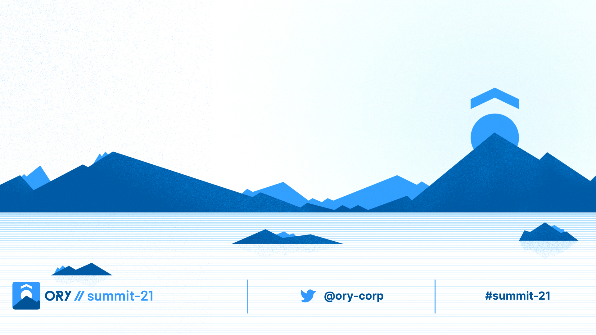
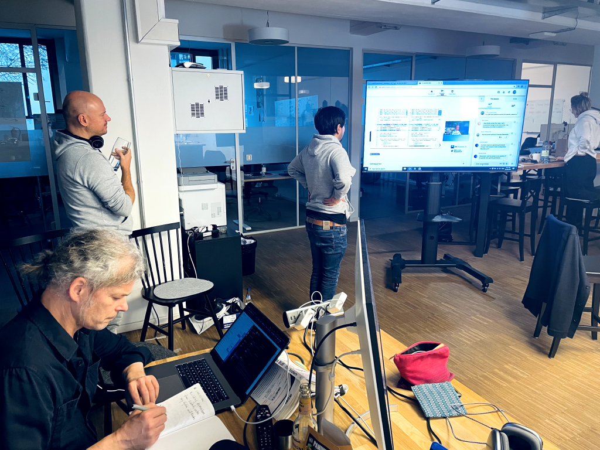
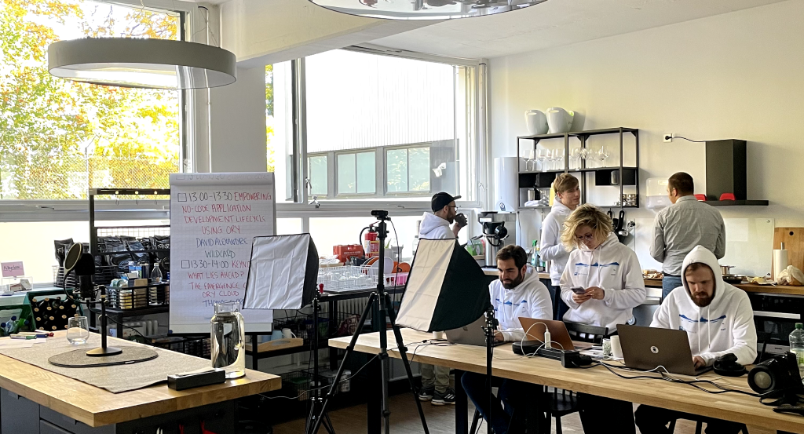
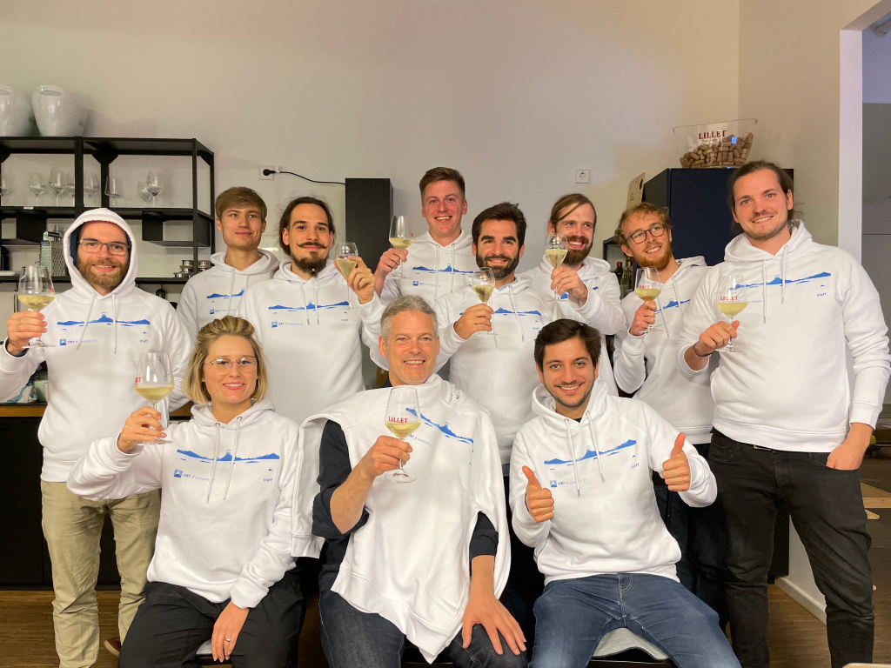

We were stoked to pull off the first Ory Summit 2021 in October, bringing
together an all-star group of developers who presented on the diverse ways in
which they use Ory open source products. We bootstrapped the two-day Ory Summit
with a core team of three people, supported by the rest of Ory, plus the
presenters, members of our open source community who were generous with their
time and energy.

> All Ory Summit 2021 presentations can be watched again
> [here](https://www.ory.sh/summit/2021/).

Normally such events are executed with three times the amount of resources and
time, so we had to find an efficient framework for making our first conference a
success. In retrospect, we learned loads about how to run a live digital event
for developer communities, and that’s what we want to share in this article.

### Why we held the Summit

Digital human communities usually center around recurring events that bring them
together in one place to share a communal spirit, exchange ideas, and get to
know each other. The Ory Summit is the first recurring event for the Ory
Developer Community.

Ory services provide free and open identity infrastructure for a lot of
different platforms – examples include an Anime media aggregator called
[Animeshon](https://www.ory.sh/summit/2021/google-iam-from-scratch/), or
[SumUp](https://www.ory.sh/summit/2021/self-service-oidc-terraform-hydra/), a
payments company specializing in solutions for small businesses. We thought our
developer community would enjoy more opportunities to share the challenges and
solutions that arise as they integrate Ory services.

### So you want to bootstrap a developer conference?

#### 1. The Basics

- **Know your audience**  
  It is hard to overstate how important this is. If you know your audience well,
  you'll understand what they expect from a community event and how to reach and
  engage them best. If you lack a clear picture of who your audience is, you may
  cast the net too wide. Ask yourself: Do you want to organize an event for a
  wide audience or the members of your community?
- **Good internet connection**  
  This is self-explanatory. If your internet connection is not tailored to
  support high-quality streaming, you'll have a bad time. 4-5mb/s up speed
  should be the minimum to stream in decent quality; more is better!
- **Keep it simple**  
  Don't overcomplicate the event. In practice, this means you have to cut
  certain activities/parts of the event. If a half-comatose person can follow
  your event proceedings, organization, and planning: you're doing it right. If
  people need a half-hour introduction into how everything works and they still
  don't get it, you have a problem, officer.

#### 2. The Stack

If you have nothing but the basics mentioned before and some frontend skills, we
recommend the following for your tech stack:

- [Vercel Event Frontend](https://github.com/vercel/virtual-event-starter-kit)
- Youtube  
  It's
  [free and easy](https://www.youtube.com/howyoutubeworks/product-features/live/)
  to stream on Youtube, performance is good, and it's unlikely that your stream
  goes down. Plus, most people know the platform.
- Chat  
  We use Slack for chats. Discord is also an option, plus a myriad of other chat
  apps. If you already have a chat platform for your community, just use that!
- Authentication  
  [GitHub OAuth](https://www.google.com/url?sa=t&rct=j&q=&esrc=s&source=web&cd=&cad=rja&uact=8&ved=2ahUKEwj_gMPU8pf1AhXFSPEDHRbtDuYQFnoECAQQAQ&url=https%3A%2F%2Fdeveloper.github.com%2Fv3%2Foauth%2F&usg=AOvVaw31cUSXVzUYgKV4rCtWdwe3).
  Most developers have a GitHub account. If you want an email/password option
  and more control, we recommend using [Ory Cloud](https://console.ory.sh/).

#### 3. The Preparation

- Prepare talks, workshops and find speakers:  
  This could be an article by itself so we'll keep it brief. Since you have
  clearly defined your goals and audience for the conference, finding suitable
  topics, workshops and speakers should come naturally. Keep your eye out for
  opportunities; talk to your team, users, top community members, and
  grandmother about presenting, organizing a workshop, or managing a Q&A
  session. You may also want to publish a "Call For Papers". A CFP describes the
  themes, topics, and formalities of the conference and lists important
  information such as deadlines or the format of submissions.

  Once we had all the speakers, workshops, and sessions lined up, we sent out a
  "Speakers Package" to onboard speakers. The package contained a collection of
  banners/logos/cards for social media and a step-by-step guide on how to use
  the event platform and ensure smooth, stress-free performance on the day of
  the event.

- Organize backup presentations:  
  Hope for the best and plan for the worst. As with any live event, it’s
  necessary to plan for last-minute cancellations or emergencies. Line up at
  least a couple of replacement talks, which can come from your team or anyone
  else you feel comfortable asking to be a replacement. You can also use group
  discussions or ad-hoc workshops/hacking tutorials as backups, but keep in mind
  that those require extra time and effort to plan. If all goes well and no
  backups are required on event day, plan for a one-off session or a "surprise"
  session near the end of the event to make use of one of them.

- Practice with a dry run:  
  Create an environment that lets you simulate the real event as accurately as
  possible. Ask members of your team/friends/relatives to act as fake visitors
  or presenters. Don't do too many dry runs to preserve the goodwill of the
  lovely people helping you. My specific advice: do one initial dry run followed
  by one final "dress rehearsal". Feedback should be shared after the first dry
  run and been taken care of when doing the dress rehearsal, which should
  resemble a finalized version of the event.

- Promote the event:  
  Our main channels for promoting the Ory Summit are the Ory Community Slack,
  our newsletter, word-of-mouth, banners on our website, Twitter, and LinkedIn.
  The most effective were our Slack, newsletter, and word of mouth. The optimal
  place to market your event depends on where you interact most with your
  community. In our context, personal connections and word-of-mouth are more
  powerful means than traditional ads. We also promoted the conference on our
  GitHub, some developer conference lists, and in team members' personal
  networks. There are many ways to promote a conference and it's one of the most
  crucial ingredients of a successful event.

_Ory Headquarters during the conference._

#### 4. The Event

Seemingly a million things occur in the days leading up to a conference. Here
are some general tips to ensure success:

- Don't panic.
- Keep the team and yourself fed, watered, and as well-rested as possible.
- Double-check the technical infrastructure before and during the event,
  including equipment for recording, streaming, audio, and network connectivity.
- Have fun.
- Celebrate with an after-party 🥳.

### 5. What else?

**Remember to keep it simple**: Some things are mandatory, like a proper Code of
Conduct (the
[geekfeminism CoC](https://geekfeminism.fandom.com/wiki/Conference_anti-harassment/Policy)
or the [Berlin CoC](https://berlincodeofconduct.org/) are good examples), or
good audio quality (encourage speakers to use headsets/earpieces with boom
microphones instead of AirPods). Other features are optional for your first
bootstrapped developer conference.

Here are several topics that we didn't delve into, but should be considered:

- Code of Conduct & Inclusivity
- Audio & Video Quality Optimization
- Visual Branding
- Landing Page
- Interaction with Audience/Q&A
- Interactive Workshops
- Merchandise
- Sponsors
- Tickets (Free/Paid)  
  ...and much more

_Repurposing the Ory kitchen as Ory Summit mission control._

### 6. After the event

- Publish recorded presentations:  
  Remember to get permission from the speakers to do this!

- Do a retrospective to get feedback:  
  We sent out an exit survey that 10% of the attendees filled out and asked Ory
  team members to share feedback. Here are a few things we want to improve at
  the next Ory Summit:

  1. Use a simple event platform.
  2. Publish recordings directly after the sessions.
  3. Plan backups earlier.
  4. More content for non-technical people.
  5. More workshops & beginner sessions.

- Analyze the data:  
  This depends on what you collected. Our main source of data was the exit
  interview and some attendance metrics collected on the platform.

- Organize the next event:  
  Take a deep breath, and begin planning your next event.

### Ory Summit 2022 ⛰️

In light of how much fun we had at our first event, we are stoked for the Ory
Summit 2022. Preparation has already begun and we will soon publish a call for
papers and more. If the global health situation permits, there will be an option
to attend the Ory Summit in person this year. It will take place in Q2/Q3 – the
exact date coming soon.

We have many things planned for this year. While not wanting to spoil the
surprise, I think this is going to be the biggest Ory event ever 😁.

Thanks for reading and participating in the Ory Summit 2021. We organize this
for you, the Ory Community, so if you want to participate or help in any way,
please reach out [via email](mailto:office@ory.sh) or on our
[chat](https://slack.ory.sh/).

_Ory Team celebrating after the conference._
