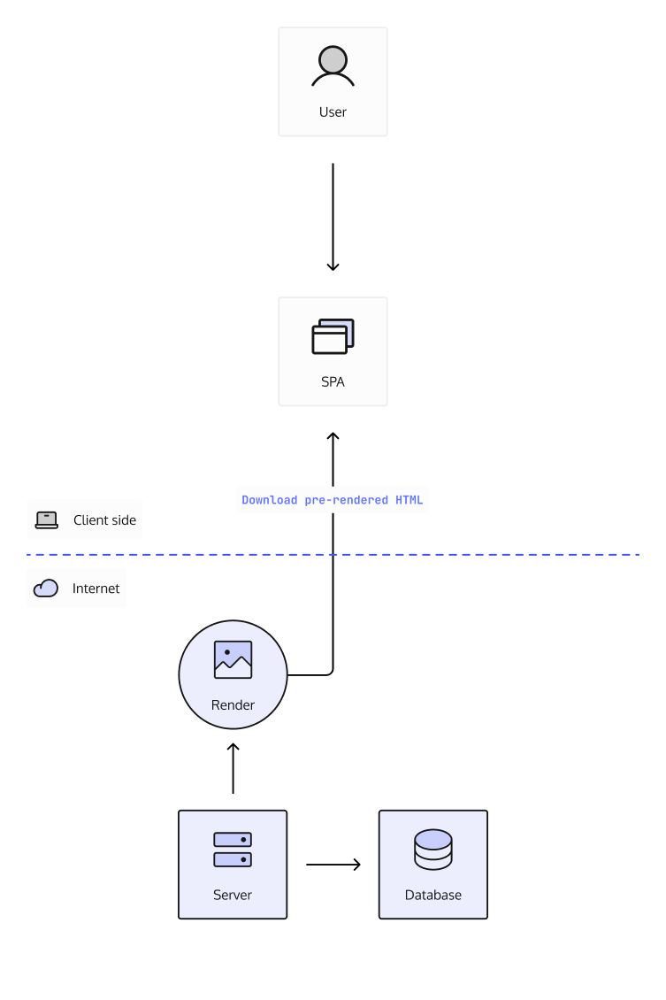

## Preface

Authentication (AuthN), although important, always intrudes in the development
process of software. As a software developer you probably have noticed a lot of
precious development time is taken (even on personal projects) to add AuthN to
your project. This is usually because of so many terminology, navigating errors
such as CORS when working in the browser and even contradicting resources on
what is the _most secure_ way of implementing AuthN. Is it using Tokens such as
JWTs? OAuth2.0? or Cookies?, the list goes on.

Furthermore, when working on different stacks we have different requirements for
User Experience (UX) and sometimes AuthN just gets in the way of that.

Hopefully this article will clarify some of that confusion and allow you to
focus on your applications' business logic.

## Terminology

If you are already familiar with Authentication, Authorization and Sessions you
can skip ahead to [The Modern Stack](./#the-modern-stack) section.

### Authentication & Authorization

Before we go any further with this blog post we first need to clarify what
Authentication (AuthN) is and how is it different from Authorization (AuthZ).
Here are the definitions:

> Authentication: The process of verifying an identity is who they say they are

> Authorization: The process of validating (through rules) if an identity or
> service or machine is allowed to access a resource or perform a certain action
> on a resource

For further reference, see these Stack Overflow posts:

- https://stackoverflow.com/questions/6556522/authentication-versus-authorization
- https://stackoverflow.com/questions/6367865/is-there-a-difference-between-authentication-and-authorization

To put it simply, when adding login to our Application, we are talking about
Authentication and when we are talking about who can do what on our Application,
we are talking about Authorization.

### Sessions

Now that we know what AuthN is, let's dive deeper by investigating all the
aspects of how AuthN works. With the use of a simple diagram, we can see the
user supplies their credentials to Project X which then validates the
credentials with the Database.

What this diagram is missing is how do we ensure the user does not need to
provide their credentials every time the user navigates to another page or does
an action. I'm sure you have heard of the term _session_. A session just means
we have created a mechanism to store information about the user in our
application, in AuthN we can use this mechanism for users to always prove they
are who they say they are without needing their credentials. So is a session
then some sort of cookie or token? Well depending on the technology or use case,
a session can be a query parameter in the URL, a Cookie storing some
information, the browser's local storage or a Token.

## The Modern Stack

In our current software climate we have the requirement to support as many
devices as possible through a single codebase, or at least in as few as
possible. This gives us the ability to maintain the software, add new features
and (hopefully) increase our user adoption.

However, through all of this we have ended up dealing with a lot of frameworks,
which creates a lot of abstraction. Although frameworks save us time when
implementing a feature, it can also happen that the framework just does not
support the underlying requirements for the feature. This can even be the case
when dealing with AuthN, some technologies do not provide a clarity on how AuthN
fits in without breaking the User Experience (UX).

Furthermore, when looking at different AuthN terminology and setting up an
application using _the modern stack_, we end up with a lot of questions. Can I
use a Cookie here? Why would it be better for a Token here? I have even seen
articles proclaim OAuth2 as the **next security standard for your Web App**
without any context of its correct usage. This article will not address OAuth2,
if you are interested, please take a look at the article
[Why you probably do not need OAuth2 / OpenID Connect](/oauth2-openid-connect-do-you-need-use-cases-examples/).

For us to understand the problems of AuthN and their solutions, we must first
understand the underlying elements at play when working with a certain
technology.

If you are already familiar with SPAs, SSRs and Native Apps, you can skip ahead
to [The Problem](./#the-problem) section.

### Single Page Applications (SPA)

Single Page applications run completely on the client's browser and do not rely
on any server interaction to keep the state of your data.
[React](https://reactjs.org/), [Angular](https://angular.io/),
[VueJs](https://vuejs.org/), etc. are examples of SPAs. If you have had any
experience writing SPAs you would have noted that they run solely in the
browser, basically HTML, CSS and Javascript. Even when dealing with
[Electron](https://www.electronjs.org/) and
[Progressive Web Apps (PWA)](https://web.dev/progressive-web-apps/) installs,
everything is running through the browser.

### Server-Side Rendering (SSR) Applications

Server-side rendered applications solve a different problem, however, they
usually build upon the already existing SPA stack. The goal is for the
application to render the pages on the server before they reach the client. This
improves page load times since the client does not need to download all the
Javascript assets before the first content is displayed. Some examples of
frameworks that allow for SSR are [NextJs](https://nextjs.org/),
[NuxtJs](https://v3.nuxtjs.org/)

### Native Applications

Applications that run on Android, iOS, Desktop and Server are all forms of
Native Applications. These applications usually provide native performance and
utilizes the Operating System's user interface to render input/output to the
user.

Examples of Frameworks that allow for Native Application development are
[Android](https://developer.android.com/), [iOS](https://developer.apple.com/)
and [.NET](https://dotnet.microsoft.com/).

Command Line Interface (CLI) Applications executed using a terminal or command
line on the Operating System also count as Native Applications and can be build
using [Go](https://go.dev/), [C++](https://isocpp.org/),
[Python](https://www.python.org/), [NodeJs](https://nodejs.org/) etc.

## The Problem

Each technology behaves differently in their respective contexts and thus requires a different solution when trying to fix AuthN.
From the above list of technologies we can see that we can more or less split the technologies into applications that
run on the user device and those that run on your controlled infrastructure. This can be further split into **server-side**,
**browsers** and **native**.

### Browsers

Browser rendered applications have a myriad of sources on AuthN all of which cause confusion since many blogs and sources advocate the usage of a different technologies to solve _sessions_.

The list looks something like this:

- JWT tokens
- OAuth2 access tokens
- Cookies

To understand the limitations of browsers and the security concerns that go with it, let's take a look at the different storage mechanisms a browser offers:

#### localStorage

  - persists to disk
  - is **not** scoped to the origin
  - accessible by Javascript

#### sessionStorage

  - only in-memory
  - is scoped to the origin e.g. https://example.com
  - accessible by Javascript

#### Web Workers
  - only in-memory
  - is scoped to the origin e.g. https://example.com
  - accessible by Javascript

#### Cookie Storage
  - persists until its expiry
  - is scoped to that origin
  - not accessible by Javascript with `httpOnly` attribute

This [OWASP HTML5 storage cheatsheet](https://cheatsheetseries.owasp.org/cheatsheets/Session_Management_Cheat_Sheet.html#html5-web-storage-api) helps us understand the differences between these.

## Vulnerabilities

https://owasp.org/www-community/attacks/xss/
https://security.stackexchange.com/questions/14093/why-is-passing-the-session-id-as-url-parameter-insecure

Sources:

- [PWA standard](https://infrequently.org/2015/06/progressive-apps-escaping-tabs-without-losing-our-soul/)
- [Progressive Web Apps (PWA)](https://web.dev/progressive-web-apps/)
- [Angular](https://angular.io/)
- [Electron](https://www.electronjs.org/)
- [VueJs](https://vuejs.org/)
- [OWASP HTML5 storage cheatsheet](https://cheatsheetseries.owasp.org/cheatsheets/Session_Management_Cheat_Sheet.html#html5-web-storage-api)
- [OWASP Testing Browser Storage](https://owasp.org/www-project-web-security-testing-guide/stable/4-Web_Application_Security_Testing/11-Client-side_Testing/12-Testing_Browser_Storage)
- [OWASP Testing Cookies](https://owasp.org/www-project-web-security-testing-guide/stable/4-Web_Application_Security_Testing/06-Session_Management_Testing/02-Testing_for_Cookies_Attributes)
- [OWASP Session management cheatsheet](https://cheatsheetseries.owasp.org/cheatsheets/Session_Management_Cheat_Sheet.html#session-management-implementation)
