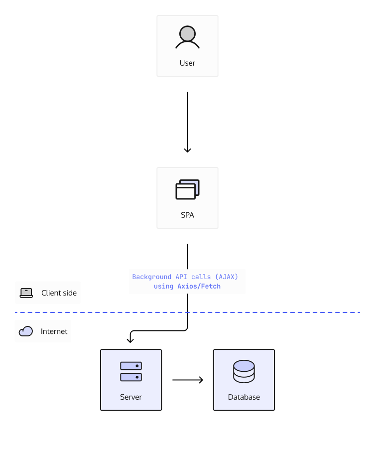

## Preface

Auth, although important, always intrudes in the development process of
software. As a software developer you probably have noticed a lot of precious
development time is taken to add Auth to a project. This is usually because of
so many terminology, navigating a sea of contradicting resources on what is the
_most secure_ way of implementing Auth. Is it using tokens such as JWTs?
OAuth2.0? or cookies?, the list goes on.

Furthermore, when working on different stacks we have different requirements for
user experience (UX) and authentication just gets in the way of that.

Hopefully this article will clarify some of that confusion and allow you to
focus on your applications' business logic.

## Terminology

If you are already familiar with authentication, authorization and sessions you
can skip ahead to [The Modern Stack](./#the-modern-stack) section.

### Authentication & Authorization

Before we go any further with this article we first need to clarify what Auth we
are talking about. There are two types, Authentication (AuthN) and Authorization
(AuthZ).

Here are the definitions:

> Authentication: The process of verifying that an identity (person, device,
> program) is who they say they are

> Authorization: The process of validating if an identity (person, device,
> program) is allowed to access a resource or perform a certain action on a
> resource.

For further reference, see these Stack Overflow posts:

- [Authentication versus Authorization](https://stackoverflow.com/questions/6556522/authentication-versus-authorization)
- [Is there a difference between authentication and authorization?](https://stackoverflow.com/questions/6367865/is-there-a-difference-between-authentication-and-authorization)

To put it simply, when adding login to our application, we are talking about
authentication and when we are talking about who can do what on our application,
we are talking about authorization.

### Sessions

Now that we know what authentication is, let's dive deeper by investigating all
the aspects of how authentication works. In this simple diagram, we can see the
user supplies their credentials to Project X which then validates the
credentials with the database.

But how do we ensure the user does not need to provide their credentials every
time the user navigates to another page or does an action?

I'm sure you have heard of the term _session_. A session just means we have
created a mechanism to store information about the user in our application, in
terms of authentication we can use this mechanism for users to always prove they
are who they say they are without needing their credentials. So is a session
then some sort of cookie or token? Well depending on the technology or use case,
a session can be a query parameter in the URL, a cookie storing some
information, the browser's local storage or a token.

## The Modern Stack

In our current software climate we have the requirement to support as many
devices (Android, iOS, Web, Desktop) as possible through a single codebase or
framework or programming language - or at least in as few as possible. This
gives us the ability to maintain the software, add new features and increase our
user adoption.

However, through all of this we have ended up dealing with a lot of frameworks,
which creates a lot of abstraction. Although frameworks save us time when
implementing a feature, it can also happen that the framework just does not
support the underlying requirements for the feature. This can even be the case
when dealing with authentication, some technologies do not provide clarity on
how authentication fits in without breaking the user experience (UX).

Furthermore, when looking at different authentication terminology and setting up
an application using _the modern stack_, we end up with a lot of questions. Can
I use a cookie here? When would it be better to use a token here? I have even
seen articles proclaim OAuth2.0 as the **next security standard for your Web
App** without any context of its correct usage. This article will not address
OAuth2, if you are interested, please take a look at the article
[Why you probably do not need OAuth2 / OpenID Connect](/oauth2-openid-connect-do-you-need-use-cases-examples/).

For us to understand the problems of authentication and their solutions, we must
first understand the underlying elements at play when working with a certain
technology.

If you are already familiar with SPAs, SSRs and native applications, you can
skip ahead to [The Problem](./#the-problem) section.

### Single Page Applications (SPA)

Single Page applications run completely on the client's browser and do not rely
on any server interaction to keep the state of your data.
[React](https://reactjs.org/), [Angular](https://angular.io/),
[VueJs](https://vuejs.org/), etc. are examples of SPAs. If you have had any
experience writing SPAs you would have noted that they run solely in the
browser, basically HTML, CSS and JavaScript. Even when dealing with
[Electron](https://www.electronjs.org/) and
[Progressive Web Apps (PWA)](https://web.dev/progressive-web-apps/) installs,
everything is running through the browser.

### Server-Side Rendering (SSR) Applications

Server-side rendered applications solve a different problem, however, they
usually build upon the already existing SPA stack. The goal is for the
application to render the pages on the server before they reach the client. This
improves page load times since the client does not need to download all the
JavaScript assets before the first content is displayed. Some examples of
frameworks that allow for SSR are [NextJs](https://nextjs.org/) or
[NuxtJs](https://v3.nuxtjs.org/)

### Native Applications

Applications that run on Android, iOS, desktop and server are all forms of
native applications. These applications usually provide native performance and
utilize the operating system to render the user interface (UI).

Examples of frameworks that allow for native application development are
[Android](https://developer.android.com/), [iOS](https://developer.apple.com/)
and [.NET](https://dotnet.microsoft.com/).

Command Line Interface (CLI) applications executed using a terminal or command
line on the Operating System also fall into the category of native applications
and can be built using a programming language like [Go](https://go.dev/),
[C++](https://isocpp.org/), [Python](https://www.python.org/) or
[NodeJs](https://nodejs.org/).

## The Problem

Each technology behaves differently in their respective contexts and thus
requires a different solution when implementing authentication. From the above
list of technologies we can see that we can more or less split the technologies
into applications that run on the user device and those that run on controlled
infrastructure, e.g. a server. This can be further split into **server-side**,
**browsers** and **native**.

### Browsers

Browser rendered applications have a myriad of information on authentication
some of which cause confusion due to each source advocating for a different
solution to solve _sessions_.

The list looks something like this:

- JWT tokens
- OAuth2 access tokens
- Cookies

To understand the limitations of browsers and the security concerns that go with
it, let's take a look at the different storage mechanisms a browser offers:

| Storage Type             | Cookie (httpOnly) | sessionStorage | localStorage | Web Workers |
| ------------------------ | ----------------- | -------------- | ------------ | ----------- |
| Persists                 | ✅                | ❌             | ✅           | ✅          |
| Origin Scoped            | ✅                | ✅             | ❌           | ✅          |
| Accessible to JavaScript | ❌                | ✅             | ✅           | ✅          |

We will use Alice as an example to explain the drawbacks of each storage type.

Alice visits `example.com` and gets some sort of token stored in her browsers.
With `localStorage` any other website she visits (e.g. `evil.com`) can extract
that information (using JavaScript) and try to impersonate her on `example.com`.

Furthermore, `sessionStorage` scopes the data which means that the origin
`example.com` can only access `example.com` data (using JavaScript), but does
not persist. So once the tab or window is closed, the token is gone!

With `cookies` - note the `httpOnly` attribute - we get persistence (until
expiry), origin scope and no JavaScript access.

Web Workers are unique in that they scope the data to the origin `example.com`
and provide JavaScript access and the storage persists.

So I guess it's settled then? Web Workers are the way to go? 🤔

Well yes and no. Quoting from the
[OWASP Session Management Cheat sheet](https://cheatsheetseries.owasp.org/cheatsheets/Session_Management_Cheat_Sheet.html#web-workers):

> The advantage of a Web Worker implementation compared to an HttpOnly cookie is
> that a Web Worker allows for some isolated JavaScript code to access the
> secret; an HttpOnly cookie is not accessible to any JavaScript. If the
> frontend JavaScript code requires access to the secret, the Web Worker
> implementation is the only browser storage option that preserves the secret
> confidentiality.

This is a niche case, most of the time we do not require any JavaScript to
access the secret (session value). On top of this **we are then responsible** in
taking care not to leak the secret, either through careless code or the
introduction of a bug. That is where cookies come in.

The interesting part about cookies are that they provide all the features we
want for `session` storage minus the headache of managing them, **they are
managed for us by the browser**. They persist after tabs or windows close (until
their expiry date) and are scoped to the origin. We can even ensure they are not
transmitted over unsecure channels by using the `Secure` attribute. Since the
browser is managing the cookie, it **decreases the risk** of a security
vulnerability leaking the session.

If you want to know more about cookies and their attributes, I would strongly
suggest checking out
[OWASP Testing Cookies](https://owasp.org/www-project-web-security-testing-guide/stable/4-Web_Application_Security_Testing/06-Session_Management_Testing/02-Testing_for_Cookies_Attributes).

To understand more about the vulnerabilities associated with JavaScript and
Cross Site Scripting (XSS) please refer to the
[OWASP XSS](https://owasp.org/www-community/attacks/xss/) document.

### Server-Side and Native Applications

Server-Side and Native applications have their own set of problems, however,
they are _usually_ easier in storing sensitive information since the environment
they run in is by definition more secure. This of course does rely on your
security practices, such as who has access to your servers.

But let's say for argument’s sake the environment is secure, then tokens can
easily be issued to a server and kept in-memory - it is not needed to store on
disk since, hopefully, your server does not restart every couple of hours 😉

On mobile Android and iOS each have their own methodology of storing tokens, but
it comes down to the same concept, these systems inherently do not share storage
through for example shared preferences (on Android) with other apps on the
device - however on rooted Android devices this is not guaranteed.

## Conclusion

There is no silver bullet in security that will fix all of our problems. By
relying on good resources, such as [OWASP](https://owasp.org) we can better
understand how to navigate security pitfalls.

With that said, it all boils down to your use case and using a token such as a
JWT or a cookie mostly relies on your use case. Whether it is better to use a
token such as a JWT or a cookie mostly relies on your use case. With
[Ory Kratos](https://www.ory.sh/kratos) we decided to stick with cookies
(httpOnly) when **using a browser** and tokens when **using a native
application**.

### Sources

- [PWA standard](https://infrequently.org/2015/06/progressive-apps-escaping-tabs-without-losing-our-soul/)
- [Progressive Web Apps (PWA)](https://web.dev/progressive-web-apps/)
- [Angular](https://angular.io/)
- [Electron](https://www.electronjs.org/)
- [VueJs](https://vuejs.org/)
- [OWASP HTML5 storage cheatsheet](https://cheatsheetseries.owasp.org/cheatsheets/Session_Management_Cheat_Sheet.html#html5-web-storage-api)
- [OWASP Testing Browser Storage](https://owasp.org/www-project-web-security-testing-guide/stable/4-Web_Application_Security_Testing/11-Client-side_Testing/12-Testing_Browser_Storage)
- [OWASP Testing Cookies](https://owasp.org/www-project-web-security-testing-guide/stable/4-Web_Application_Security_Testing/06-Session_Management_Testing/02-Testing_for_Cookies_Attributes)
- [OWASP Session management cheatsheet](https://cheatsheetseries.owasp.org/cheatsheets/Session_Management_Cheat_Sheet.html#session-management-implementation)
